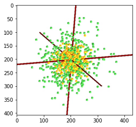
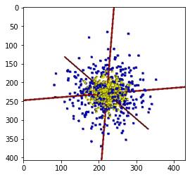
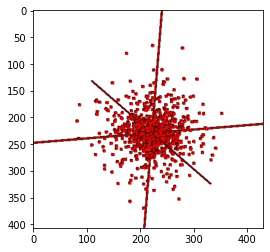

# dico_toolbox
_Pythonesque PyAims_

dico_toolbox is a set of shared tools developed for the FolDico project.

It mainly contains documented python3 recipies to manipulate and convert pyAIMS entities (volumes, buckets, graphs, meshes) into numpy arrays.


```python
%load_ext autoreload
%autoreload 2
```


```python
# A description of the package tree
import treesource as ts
tree = ts.generate_tree('..')
print(ts.render.as_text(tree))
```

    .
    └── dico_toolbox/
        ├── anatomist/ (Anatomist wrapper)
        ├── cli/ (Command line tools)
        │   └── volume_to_point_cloud.py (dtb_volume_to_point_cloud)
        ├── recipes/ (Recipes for more complex manipulations)
        ├── bucket.py (pyAims Bucket manipulation)
        ├── convert.py (conversion of pyAims and numpy objects)
        ├── database.py (access Brainvisa databases)
        ├── graph.py (pyAims Graph manipulation)
        ├── mesh.py (PyAims Mesh manipulation)
        ├── skeleton.py (topological values of Aims skeletons)
        ├── transform.py (geometrical transformation)
        ├── volume.py (pyAims Volume manipulation)
        └── wrappers.py (wrappers for pyAims objects e.g. PyMesh)
    


## The Anatomist wrapper


```python
import dico_toolbox as dtb
from soma import aims
import numpy as np
import matplotlib.pyplot as plt
```


```python
%%capture
%gui qt

# run this cell only once, at the beginning.
an = dtb.anatomist.Anatomist()
```


```python
# run this line only after the Anatomist window appears
%matplotlib inline
```


```python
# a random point cloud
rpc1 = (5*np.random.randn(400,3)).astype(int)
rpc2 = (10*np.random.randn(400,3)).astype(int)
```


```python
# draw objects (with automatic colors) 
an(rpc1, rpc2)

# an.color_random() can be used to re-assign random colors to all the objects
```


```python
# get a snapshot
plt.imshow(an.snapshot());
```


    

    


```python
# use a dictionnary
d = {
    "first" : rpc1,
    "second": rpc2
}

an.clear_quick_window()
an(d)
```


```python
# set colors
an.set_objects_color('first', b=1)
an.set_objects_color('second', g=1)
```


```python
plt.imshow(an.snapshot());
```


    

    


```python
# get the instance of the anatomist object
anatomist_instance = an.get_anatomist_instance()
print(anatomist_instance.getVersion())
```

    5.1.0


```python
# remove one object
an.delete_objects('first')
```


```python
plt.imshow(an.snapshot());
```


    

    


```python
an.delete_all_objects()
```


```python
an.close()
```
